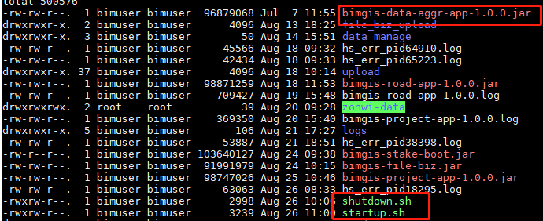
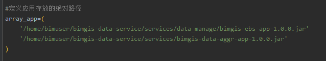
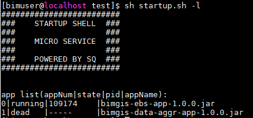
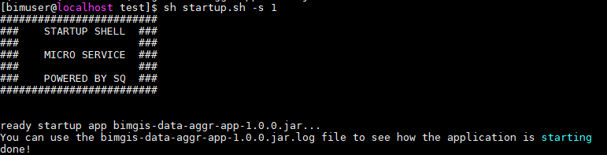
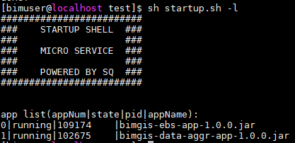
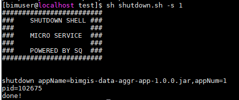
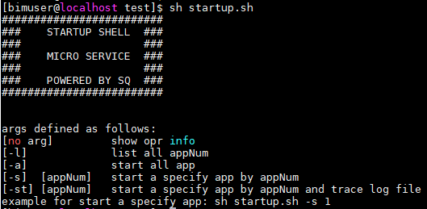

# dev_tool
Share tools to improve development efficiency, mainly for Java development

## 1.Springboot微服务管理工具程序(micro_sys_shell)
### 1.1 特性
+ 适合小开发团队（低于10人）在未使用商业CI/CD系统做微服务部署前使用
+ 一个Linux系统运行的shell脚本程序，可根据自己情况进行扩展
+ 集中管理应用大幅减少手动部署SpringBoot jar包应用的工作量
+ 支持单独或批量启动、停止应用
+ 支持查看应用启动情况
+ 每个应用分配单独的日志文件，方便查看日志
+ 可以配合gradle脚本实现一键部署功能（稍后介绍）

### 1.2 快速上手
  下面以部署bimgis-data-aggr-app-1.0.0.jar应用为例讲解如何使用micro_sys_shell：
1. 拷贝startup.sh、shutdown.sh脚本到应用部署的Linux环境；

2. 将需要管理的应用jar包完整路径填入startup.sh和shutdown.sh中的array_app数组变量中；

3. 执行 sh startup.sh -l （获取应用状态和appNum，这里appNum=1）

说明：
+ appNum:应用数字编码，用于启动、停止引用
+ state：应用状态，running-正在运行，dead-未运行
+ pid：应用进程号

4. 执行 sh startup.sh -s 1 （启动应用）

5. 执行 sh shutdown.sh -s 1  （停止应用）

### 1.3 查看工具程序支持的命令参数
执行 sh startup.sh

